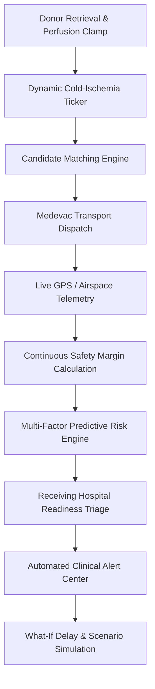
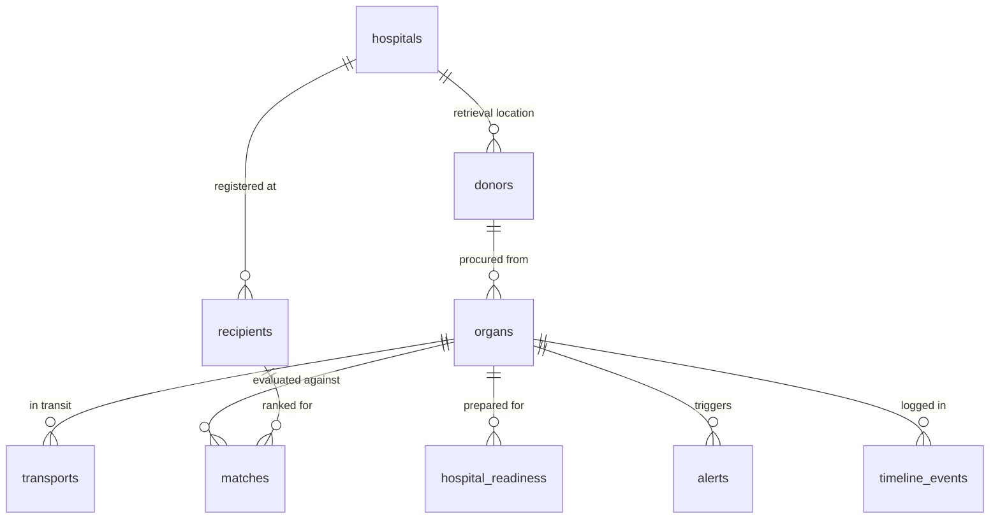

# 🫀 TransplantFlow AI
### Intelligent Organ Transplant Coordination & Cold-Ischemia Risk Prediction Platform

> **Clinical Decision-Support & Synthetic Data Notice**:
> TransplantFlow AI is an advanced clinical decision-support and organ digital twin prototype. It does **NOT** autonomously allocate organs, make final transplant decisions, replace medical practitioners, or supersede authorized organ procurement organizations (e.g., UNOS, Eurotransplant). All patient, hospital, and donor data presented are synthetic.

---

## 1. Executive Summary & Problem Statement

Organ transplantation is one of the most time-critical procedures in modern medicine. Once an organ is retrieved from a donor, it enters a finite **cold-ischemia preservation window**:
- **Heart**: 4 hours (240 minutes)
- **Lung**: 6 hours (360 minutes)
- **Liver**: 12 hours (720 minutes)
- **Kidney**: 24 hours (1440 minutes)

Traditionally, transplant workflows operate across disconnected silos:
- Donor organ retrieval times
- Waitlist recipient candidate priority
- Courier and medevac transport telemetry
- Real-time traffic, flight delays, and weather diversions
- Receiving hospital operating room and ICU bed readiness

When delays occur, coordinators are forced to make high-stakes calculations manually under intense cognitive pressure. Unpredicted transit delays or unprepared hospital suites risk irreversible organ degradation, graft failure, or discarded organs.

**TransplantFlow AI** solves this by unifying all operational variables into a real-time **Transplant Digital Twin** that continuously evaluates:
> *"Can this organ realistically reach the intended hospital within the remaining preservation window?"*

---

## 2. Main Innovation: The Transplant Digital Twin

Unlike traditional organ-matching registries that treat allocation as a static database lookup, TransplantFlow AI builds a continuous **Digital Twin** tracking the entire end-to-end journey of every organ:



---

## 3. Core Features

### 🟢 1. Cold-Ischemia Intelligence & Safety Margins
Calculates remaining preservation time dynamically every second:
$$\text{Safety Margin} = \text{Remaining Preservation Time} - \text{Transport ETA}$$
- 🟢 **SAFE MARGIN**: $\ge 30\text{ minutes}$
- 🟠 **WARNING**: $10\text{ to }< 30\text{ minutes}$
- 🔴 **CRITICAL**: $0\text{ to }< 10\text{ minutes}$
- ⚫ **EXPIRED**: $\le 0\text{ minutes}$

### 🔮 2. Future Risk Prediction Engine
A multi-factor predictive model combining:
- **Time Pressure (40%)**: Ratio of elapsed preservation and safety margin compression
- **Transport Delay (20%)**: Active traffic, weather detours, or runway holdovers
- **Hospital Readiness (20%)**: 5-point readiness matrix deficit
- **Route Risk (10%)**: Atmospheric and congestion telemetry
- **Clinical Acuity (10%)**: High-priority rescue allocations

Produces normalized risk scores (0–100%), categorical risk levels (`LOW`, `MEDIUM`, `HIGH`, `CRITICAL`), identified contributing factors, and deterministic operational recommendations for clinical coordinators.

### 🧪 3. "What-If" Delay Simulation Workbench
Allows coordinators to simulate $+10\text{m}$, $+20\text{m}$, $+30\text{m}$, $+60\text{m}$, or custom delays with live delta visualizations:
- Baseline ETA vs. Simulated ETA
- Baseline Safety Margin vs. Simulated Safety Margin
- Visual Delay Sensitivity Curve powered by Recharts
- Preservation breach detection (`VIABLE`, `BORDERLINE`, `CRITICAL_RISK`, `PRESERVATION_BREACH`)

### 🚁 4. Alternative Scenario & Multi-Modal Comparison
Compares alternative transit vectors and modalities side-by-side:
- Route A: Ground Highway Express (Ambulance)
- Route B: Ground Metropolitan Bypass
- Route C: Medevac Air Rotorway (Helicopter)
- Route D: Regional Fixed-Wing Turboprop

Evaluates ETA, safety margin, and risk scores to highlight the optimal operational route.

### 🎯 5. Decision-Support Candidate Matching
Transparent candidate ranking evaluating ABO compatibility (universal donor and Rh-factor matching), clinical urgency tiers, transit feasibility, distance, and waitlist seniority with customizable criteria weight sliders and a full scoring audit drawer.

### 🏥 6. Receiving Hospital Readiness Matrix
5-point clinical checklist tracking:
1. Operating Room prep & turnover
2. ICU post-op bed availability
3. Surgical transplant team scrub status
4. Cross-matched PRBC blood reserves
5. Recipient pre-op clearance

### 🗺️ 7. Real-Time Transport Map with Moving Simulation
React Leaflet map with CartoDB Dark Matter tiles tracking origin donor hospitals, moving medevac vehicles with pulsing telemetry markers, and destination transplant centers with animated vehicle simulation.

### 🚨 8. Real-Time Clinical Alert Center
Multi-severity alert system (`CRITICAL`, `HIGH`, `MEDIUM`, `INFO`) tracking safety margin compression, ICU unreadiness, and traffic delays with instant acknowledge and resolution workflows.

### 📜 9. Milestone Audit Timeline
Chronological vertical timeline logging cross-clamp retrieval, perfusion initiation, flight departures, weather deviations, and surgical handoffs.

### ⚡ 10. Automated 13-Stage Live Clinical Demo
An automated 13-stage demonstration script that simulates donor heart retrieval, candidate matching, transport dispatch, real-time marker movement, weather delay induction, safety margin deterioration, critical alert broadcast, hospital triage, and alternative aviation clearance.

---

## 4. Technology Stack

- **Frontend**: React 19, TypeScript, Vite, Tailwind CSS
- **Routing & State**: React Router DOM, TanStack Query (React Query)
- **Visualizations**: Recharts, Lucide React
- **Geospatial & Mapping**: Leaflet, React Leaflet, OpenStreetMap / CartoDB tiles
- **Backend & Database**: Supabase PostgreSQL, Row Level Security (RLS), Supabase Auth & Realtime
- **Resilience**: In-memory and local storage reactive fallback ensuring full functionality in cloud and offline modes
- **Testing**: Vitest unit test suite

---

## 5. Database Schema & Architecture



Database migrations and seed scripts are located in:
- `supabase/migrations/001_initial_schema.sql`
- `supabase/migrations/002_rls_policies.sql`
- `supabase/seed/seed_data.sql`

---

## 6. Installation & Local Development

### Prerequisites
- Node.js >= 18
- npm >= 9

### Step 1: Clone Repository
```bash
git clone https://github.com/METHUNSM001/transplantflow-ai.git
cd transplantflow-ai
```

### Step 2: Install Dependencies
```bash
npm install
```

### Step 3: Configure Environment (Optional)
Copy `.env.example` to `.env`:
```bash
cp .env.example .env
```
*(If no Supabase credentials are provided, TransplantFlow AI automatically switches to its high-fidelity local demonstration store with zero configuration required!)*

### Step 4: Run Development Server
```bash
npm run dev
```

### Step 5: Run Automated Tests
```bash
npm test
```

### Step 6: Build for Production
```bash
npm run build
```

---

## 7. Medical & Legal Disclaimer

**TransplantFlow AI is a decision-support prototype and research demonstration.** It does not replace medical judgment, certified physicians, or legally authorized organ allocation policies (such as the Organ Procurement and Transplantation Network - OPTN / UNOS). Never rely on this demonstration system for real-world medical treatment decisions or emergency dispatch commands.
