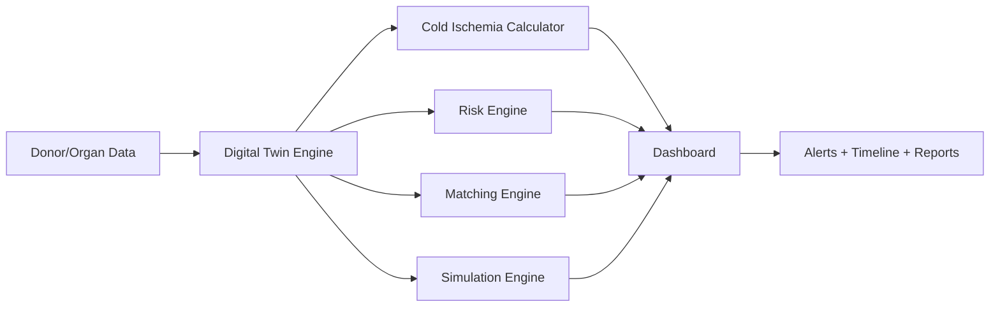

# TransplantFlow AI

TransplantFlow AI is a decision-support prototype for transplant coordination. It models real-time cold-ischemia pressure, route risk, hospital readiness, and digital-twin monitoring for organ transport operations using synthetic demo data.

## Problem

Organ transport is time-sensitive. Preservation windows are narrow, and delays can push an organ beyond a safe margin. Separate systems for donor information, recipient matching, transport tracking, and readiness often create operational blind spots.

## Solution

This project centralizes donor, organ, transport, and readiness data in one operational dashboard. The platform highlights remaining preservation time, live risk, ETA, safety margin, matching support, and what-if scenario planning without making final clinical decisions.

## Digital Twin Concept

The digital twin models an organ's current condition, remaining preservation time, route ETA, safety margin, hospital readiness, and likely future risk. It continuously extrapolates what is happening now and what could happen next.

## Features

- Cold-ischemia intelligence and configurable thresholds
- Rule-based risk engine with operational reasons and actions
- Simulation of delay scenarios and alternative routes
- Decision-support candidate ranking for recipients
- Hospital readiness scoring and alerts
- Multi-organ command center dashboard
- Realtime-style alerting and timeline tracking
- Responsive healthcare operations UI
- Synthetic demo data and live-demo sequence

## Architecture



## Tech Stack

- React + TypeScript + Vite
- Tailwind CSS
- React Router
- TanStack Query
- React Hook Form + Zod
- Recharts
- Lucide React
- Leaflet / React Leaflet
- Supabase
- Vitest

## Database and Auth

This scaffold is ready for Supabase integration. A schema and RLS structure can be added under Supabase migrations while using only VITE_SUPABASE_URL and VITE_SUPABASE_ANON_KEY in the frontend.

## Risk Engine

The risk engine uses a transparent weighted scoring model normalized to 0-100. Values map to LOW, MEDIUM, HIGH, and CRITICAL depending on preservation window pressure, delay, readiness, route condition, transport status, and priority.

## Matching Engine

The matching engine produces a transparent, ranked candidate list using compatibility, urgency, time feasibility, distance, and waiting time. It is labeled as decision support and does not determine final transplant allocation.

## Simulation Engine

The simulation engine compares current operational state with a delayed scenario to estimate new ETA, revised safety margin, and risk.

## Installation

```bash
npm install
npm run dev
```

## Environment Variables

Create a local `.env` file using `.env.example`:

```bash
cp .env.example .env
```

Then add:

```bash
VITE_SUPABASE_URL=
VITE_SUPABASE_ANON_KEY=
```

## Local Development

```bash
npm run dev
```

## Testing

```bash
npx vitest run
```

## Build

```bash
npm run build
```

## Security and Medical Disclaimer

This is a software prototype and decision-support demonstration. It does not replace clinical judgment, authorized transplant allocation policies, or emergency medical services. No real patient data is used.

## Future Improvements

- Supabase schema and RLS policies
- Realtime subscriptions and auth
- Route simulation and map live movement
- AI-backed decision models
- Advanced reporting and export flows

